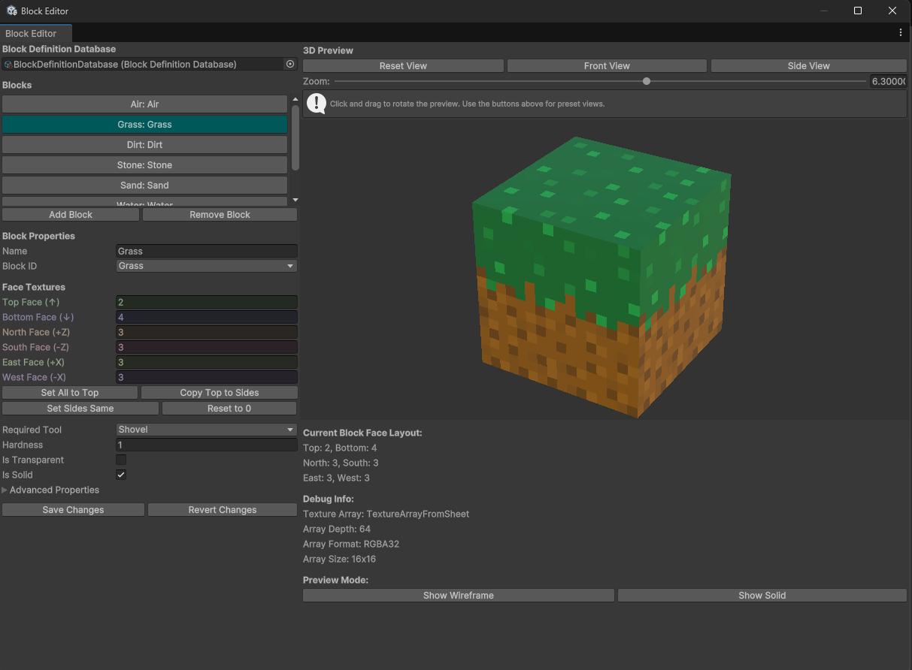

# BlockEditor (editor)

Location: `Assets/ActualStuff/EditorStuff/Editor/BlockEditor.cs`

This tool is essentially a block editor, allowing oyu to easity change block textures on the fly using a visual interface!

Summary
- EditorWindow (Tools > Voxel Engine > Block Editor) for per-face texture editing
- 3D preview with six quads; extracts Texture2D slices (fallback colored tiles)
- Edits per-face indices and advanced props; batch ops like Set All / Copy Top to Sides

Inspector/Window UI
- Database: pick/create `BlockDefinitionDatabase` (auto-creates at Assets/BlockDefinitionDatabase.asset if missing)
- Blocks list: select block; Add/Remove
- Properties: name, BlockId, per-face indices, gameplay (tool, hardness, flags), physics, audio
- Actions: Save Changes, Revert
- Preview: rotation/zoom controls; material wireframe/double-sided toggles

Related
- [BlockDefinition](block-definition.md), [BlockDefinitionDatabase](block-definition-database.md)

[Back to overview](../overview.md)
